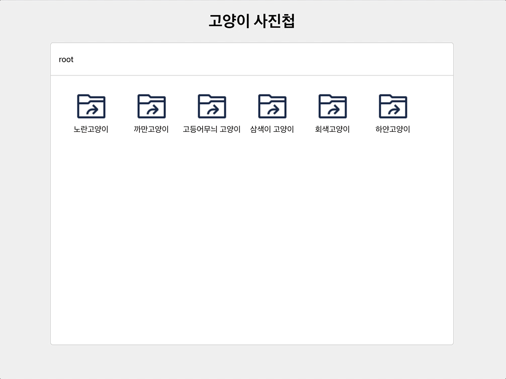

# kitty-photo-album

### **[프로그래머스 과제] 고양이 사진첩 애플리케이션 with React**

프로그래머스 과제관의 [고양이 사진첩 애플리케이션](https://programmers.co.kr/skill_check_assignments/100 "프로그래머스 고양이 사진첩 애플리케이션") 을 React + Typescript 로 구현



<br />

## Install

---

<br />

1. 패키지 설치
   ```sh
   npm install
   ```
   or
   ```sh
   yarn install
   ```
   <br />
2. 실행
   ```sh
   npm start
   ```
   or
   ```sh
   yarn start
   ```

<br />

## Description

---

<br />

> 당신은 고양이들을 모시고 있는 어느 집사에게 자신의 고양이 사진을 관리해달라는 의뢰를 받았습니다.  
> 의뢰인은 당신이 믿을만한 사람인지 테스트하기 위해, 약간의 사진을 당신에게 보냈으며 이 사진들을 웹에서 볼 수 있도록 해달라고 합니다.  
> 이 사진을 어떻게 처리할까 고민 중이던 때, 당신의 절친한 친구 Back-end 개발자가 당신을 돕기 위해 의뢰인이 보낸 사진들을 API 형태로 만들어 주었습니다.  
> 이 API를 이용해, 의뢰인을 만족시킬 수 있는 고양이 사진첩 애플리케이션을 만들어 봅시다!

</br>

### 필수 구현 사항

- `Breadcrumb` 에 현재 탐색 중인 경로 표시. root 를 맨 왼쪽에 넣어야 하며, 탐색하는 폴더 순서대로 표시
  - 사진첩을 처음 들어간 상태라면 root 경로 탐색 중이므로 `root` 만 나올 것
  - root 를 기준으로 `노란고양이` 를 클릭했다면 `root - 노란고양이` 처럼 root 를 시작점으로 하여 거쳐간 디렉토리 이름을 순서대로 나열할 것
- 현재 탐색 중인 경로에 속한 파일 / 디렉토리를 렌더링. 렌더링 된 Node 클릭 시 node 의 type 에 따라 다음과 같이 처리
  - DIRECTORY : 해당 디렉토리에 속한 파일 / 디렉토리를 불러와 렌더링
  - FILE : Node 의 filePath 값을 이용해 이미지를 불러와 화면에 렌더링
  - root 경로가 아닌 경우, Nodes 목록 맨 왼쪽에 이전 디렉토리로 이동할 수 있는 기능 구현
- 파일을 클릭한 경우 Modal 을 하나 띄우고 해당 Modal 에서 파일의 이미지를 렌더링

<br />

### 옵션 구현사항

- ~~Breadcrumb 에 렌더링 된 경로 목록의 특정 아이템을 클릭하면 해당 경로로 이동하도록 처리~~ -> **구현 예정**  
  ~~ex) Breadcrumb 에 `노란고양이 - 2021/04` 가 렌더링 된 상태인 경우~~
  - ~~`2021/04` 를 클릭한 경우 현재 경로와 같으므로 아무 일도 일어나지 않음~~
  - ~~`노란고양이` 를 클릭하면 노란고양이 경로 기준으로 파일 / 디렉토리 목록 렌더링~~
  - ~~`root` 를 클릭하면 root 경로 기준으로 파일 / 디렉토리 목록 렌더링~~
- 파일을 클릭하여 이미지를 보는 경우, 닫을 수 있도록 처리
  - ESC 키를 눌렀을 때와 이미지 밖을 클릭했을 때, 둘 중 한 가지 혹은 두 가지 모두 처리
- 데이터가 로딩 중인 경우는 로딩 중임을 알리는 UI 처리를 하고, 로딩 중에는 디렉토리 이동이나 파일 클릭 등이 안되도록 처리
- 한 번 로딩된 데이터는 메모리에 캐시하고 이미 탐색한 경로를 다시 탐색할 경우 http 요청을 하지 않고 캐시된 데이터를 렌더링

<br />
